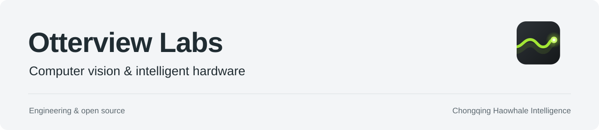

<picture>
  <source media="(prefers-color-scheme: dark)" srcset="banner-dark.svg">
  
</picture>

  <a href="https://otterview-labs.github.io/zh/"><b>官网</b></a> ·
  <a href="#我们在做什么"><b>我们在做什么</b></a> ·
  <a href="#公开仓库"><b>公开仓库</b></a> ·
  <a href="#参与贡献"><b>参与贡献</b></a>

  
  
  

# Otterview Labs

Otterview Labs 是 **JetLinks 旗下的一条技术线**，由重庆浩鲸智能团队推进。

我们从现场遇到的问题开始做软件：从图片、视频和摄像头流里找出人、车和事件，再交给人确认；确认之后，结果还要能回到现场应用里。

现在主要做两条线：**视觉检索**和**现场设备**。边缘盒、机械臂和消防主机都在现场设备这条线上。机器人方向先从机械臂开始。

这里的仓库，是正在使用、正在整理，或者值得留下来的几条线。每个仓库都会写清楚怎么运行、需要什么，以及目前还缺什么。

## 我们在做什么

<table>
<tr>
<td width="50%" valign="top">

### 👁️ 视觉检索

SightIndex 用来在图片、视频和 RTSP / HTTP 摄像头流里找人、车和事件。系统先给出结果，再由人复核。

</td>
<td width="50%" valign="top">

### 📦 现场设备

我们希望这套能力能在工厂、园区和展厅里长期运行。边缘盒、机械臂和消防主机，都属于这条线。

</td>
</tr>
<tr>
<td width="50%" valign="top">

### 🧠 模型训练

JetLinks AI 训练平台目前用于内部研发，覆盖数据集、训练、评测和训练产物，再把模型放回实际场景里验证。

</td>
<td width="50%" valign="top">

### 🧰 开发工具

agentBridge 管理本地的 Codex、Claude Code 和 Gemini CLI 会话。我们自己也用它处理日常开发和需要人工确认的操作。

</td>
</tr>
</table>

### 另一条线：ChatBI

ChatBI 是一条支线，尝试用自然语言提问数据，返回 SQL、图表和报告。它和视觉检索、现场设备不是同一条产品线。

## 公开仓库

<table>
<tr>
<td width="50%" valign="top">

### 🧭 [agentBridge](https://github.com/otterview-labs/agentbridge)

把本地 Codex、Claude Code 和 Gemini CLI 会话放在一个地方管理，提供 Web 控制台、CLI、HTTP API、任务跟踪和人工确认流程。

`TypeScript` · `Node 22+` · `tmux` · `SQLite`

[README](https://github.com/otterview-labs/agentbridge#readme) · [文档](https://github.com/otterview-labs/agentbridge/tree/main/docs)

</td>
<td width="50%" valign="top">

### 👁️ [SightIndex](https://github.com/otterview-labs/SightIndex)

自部署的视觉索引与检索服务，支持图片、视频和 RTSP / HTTP 摄像头流，提供 FastAPI 接口和 Vue 控制台。

`Python 3.11+` · `FastAPI` · `Vue 3` · `Milvus（可选）`

[README](https://github.com/otterview-labs/SightIndex#readme) · [中文说明](https://github.com/otterview-labs/SightIndex/blob/main/README.zh-CN.md)

</td>
</tr>
<tr>
<td width="50%" valign="top">

### 📡 [LutraPipe](https://github.com/otterview-labs/LutraPipe)

面向高通边缘盒的多路 RTSP 视频管线示例，使用 .NET 10 和 GStreamer，关注硬件解码、逐路指标和现场视频处理。

`C#` · `.NET 10` · `GStreamer` · `Qualcomm Q900`

[README](https://github.com/otterview-labs/LutraPipe#readme)

</td>
<td width="50%" valign="top">

### 💬 [ChatBI](https://github.com/otterview-labs/chatbi)

自然语言问数原型：用自然语言提问，返回 SQL、图表和报告，支持多数据源和定时报告。

`Prototype` · `FastAPI` · `Vue` · `Text-to-SQL`

[README](https://github.com/otterview-labs/chatbi#readme)

</td>
</tr>
</table>

 
agentBridge /studio：每天的会话和待处理事项放在一起，真正执行之前仍由人确认。

## 怎么开始

先选一个仓库，再从 README 开始。我们会在仓库里说明支持的环境、配置方式、部署方法和当前限制。

- 想看本地 AI 会话怎么管理：从 [agentBridge](https://github.com/otterview-labs/agentbridge) 开始。
- 想看视觉检索怎么部署：从 [SightIndex](https://github.com/otterview-labs/SightIndex) 开始。
- 想看边缘视频怎么处理：从 [LutraPipe](https://github.com/otterview-labs/LutraPipe) 开始。

如果你准备运行涉及摄像头、人脸或找人的功能，请先阅读对应仓库的授权、权限控制、数据留存和人工复核说明。

## 我们比较在意的事

- **能在本地跑，就先在本地跑。** 数据、会话和运维边界留在自己的机器上。
- **先把限制写出来。** 依赖什么、哪里还不稳定、出了问题怎么排查，都放进文档。
- **模型可以替换。** 通过清楚的接口连接模型和服务，不把项目绑在单一提供商上。
- **结果要有人确认。** 对敏感媒体和生物特征相关能力，授权、访问控制和人工复核都不能省。

## 最近在做什么

- 继续整理边缘盒上的视频接入和本地推理。
- 让视觉检索和现场设备之间的连接更简单。
- 继续推进机械臂和消防主机相关的设备工作。
- 维护 agentBridge、SightIndex 和 LutraPipe 的文档与部署方式。

## 参与贡献

欢迎提交 Issue、文档改进、可复现的错误报告和聚焦明确的 Pull Request。提交时请说明问题、运行环境和预期行为；较大的改动可以先开 Issue 讨论。

各仓库的许可证和部署要求以仓库内文档为准。agentBridge 采用 Apache-2.0，其余项目请查看各自的 README 和第三方声明。

 
<a href="https://otterview-labs.github.io/zh/">🌐 Otterview Labs 官网</a> · <a href="https://github.com/otterview-labs">GitHub</a> · <a href="https://otterview-labs.github.io/zh/blog/">技术文章</a>
  
我们自己也在用这些工具。

